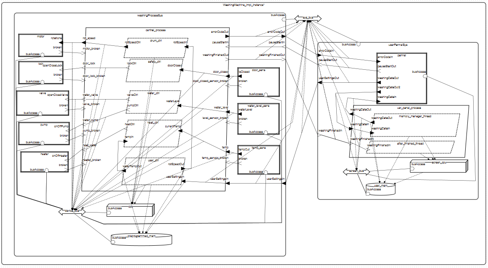

# Model systemu: Pralka automatyczna (AADL)
Real-time Systems course

## Moje dane:

**Imię i nazwisko:** Konrad Tendaj  
**E-mail:** kon.tendaj@gmail.com

## Opis modelowanego systemu

### Ogólny opis
Model przedstawia system sterowania pralką automatyczną, zaprojektowany przy użyciu języka AADL w środowisku OSATE. Pralka jako system wbudowany składa się z wielu komponentów realizujących funkcje takie jak: napełnianie wodą, podgrzewanie, wirowanie, odpompowywanie wody, obsługa panelu użytkownika oraz komunikacja między komponentami.

### Opis dla użytkownika
System odwzorowuje podstawowe cykle prania i obsługiwany jest przez użytkownika za pomocą prostego interfejsu, który pozwala na wybór trybu pracy. Model umożliwia analizę działania oraz wykrywanie potencjalnych błędów projektowych we wczesnej fazie tworzenia systemu.

## Spis komponentów AADL z komentarzem 

| Typ komponentu | Nazwa komponentu | Opis |
| -------------- | ---------------- | ---- |
| device | WasherMotor | silnik do obracania bębna |
| device | WaterValve | zawór elektroniczny do wody |
| device | WaterLevelSensor | czujnik kontrolujący poziom wody w bębnie |
| device | WaterPump | pompa wyciągająca wodę z bębna |
| device | WaterHeater | grzejnik do wody |
| device | TemperatureSensor | czujnik temperatury wody w zbiorniku |
| device | DoorClosedSensor | czujnik zakmnięcia drzwiczek |
| device | DoorLock | zamek do blokowania drzwi |
| device | UserPannel | ekran sterowania pralką razem z pokrętłem do zmiany trybu pralki |
| processor | Microcontroller | procesor do sterowania procesem prania w pralce |
| processor | ScreenMicrocontroller | procesor do sterowania wyświetlaczem |
| memory | PreprogrammedMemory | pamięć przechowująca szczegóły konkretnych trybów (czas prania, ilość wody, liczba cykli, itd.) |
| memory | UserSettingsMemory | pamięć do przechowywania ostatnich ustawień programu użytkownika |
| bus | DeviceBus | magistrala łącząca sieć urządzeń pralki z procesorem `Microcontroller` i pamięcią `PreprogrammedMemory` |
| bus | ScreenBus | magistrala łącząca wyświetlacz pralki z procesorem `ScreenMicrocontroller` i pamięcią `UserSettingsMemory` |
| bus | SystemBus | magistrala łącząca dwa systemy ze sobą, komunikacja dwóch procesorów |
| system | WashingMachine | główny system całej pralki zawierającym podsystemy i łączącą jest magistralę |

### Podsystem `WashingProcessSystem`
| Typ komponentu | Nazwa komponentu | Opis |
| -------------- | ---------------- | ---- |
| system | UserPannelSystem | system odpowiedzialny za odczytywanie danych użytkownika z pamięci, zapisu do niej, obsługi wyświetlacza i kontroli pralki |
| process | UserPannelProcess | główny proces podsystemu wyświetlacza, łączy wątki z urządzeniami |
| thread | AfterFinishedThread | wątek powiadamiający użytkownika o końcu prania |
| thread | MemoryManagerThread | wątek odczytujący i pobierający dane użytkownika z pamięci |

### Podsystem `UserPannelSystem`
| Typ komponentu | Nazwa komponentu | Opis |
| -------------- | ---------------- | ---- |
| system | WashingProcessSystem | system odpowiedzialny za pranie |
| process | MainController | główny proces pralki kontrolujący wszystkie jej czynności, łączy wątki z urządzeniami |
| thread | WaterController | wątek do kontrolowania poziomu wody w pralce |
| thread | DrumController | wątek kontrolujący obroty bębna |
| thread | HeatController | wątek kontrolujący temperaturę wody |
| thread | SafetyController | wątek, który dba o zamknięcie drzwi na czas prania |
| thread | UserInputController | wątek, który pobiera ustawiony przez użytkownika tryb, oblicza dodatkowe właściwości prania i zwraca parametry do reszty procesu |

## Pełny model systemu

### Podsystem `WashingProcessSystem`

### Podsystem `UserPannelSystem`

## Proponowane metody analizy modelu. Wyniki przeprowadzonych analiz. 

...

## Literatura
1. https://github.com/GaloisInc/CASE-AADL-Tutorial/tree/main/aadl_book/chapter1_aadl_basics